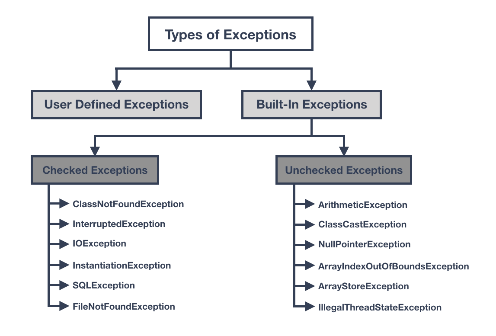

*This chapter is a summary based on “Clean Code” by Robert C. Martin. All rights reserved by the original author.*

# Error Handling
Although we aim to write code that never fails, error handling is sometimes a must-have. When needed, it should be as clean and explicit as possible.

## 1. Exceptions Instead of Returns Codes
Beginners (and somethimes even experienced programmers) often try to handle errors by returning special codes or just logging an error. This nakes the code harder to use and easier to misuse. for example:
```java
class Rational {
    private final float numerator;
    private final float denominator;

    public Rational(float numerator, float denominator) {
        if (denominator == 0) {
            logger.log("Unable to create a rational value with 0 as denominator");
            this.numerator = 0;
            this.denominator = 1; // fallback
            return; // silently returns "invalid" object
        }

        this.numerator = numerator;
        this.denominator = denominator;
    }
}
```
This does not make sense $\rightarrow$ The calling code won't know wheter the object is valid or not.

We should refactorize the previus code like:
```java
class Rational {
    private final float numerator;
    private final float denominator;

    public Rational(float numerator, float denominator) {
        if (denominator == 0) {
            throw new IllegalArgumentException("Denominator cannot be zero");
        }
        this.numerator = numerator;
        this.denominator = denominator;
    }
}
```
and now the caller could handle the error properly:
```java
try {
    Rational r = new Rational(1, 0);
} catch (IllegalArgumentException e) {
    logger.log("Failed to create rational: " + e.getMessage());
}
```
## 2. Checked vs Unchecked Exceptions

In Java there are 2 big families of exceptions:
1. **Checked Exceptions** (extends `Exception`, but not `RuntimeExceptions`).
In this case Java force you to 2 possible options:
   * Catch them with a `try-catch`.
   * Declare them in the method with `throws`.
1. **Unchecked Exceptions** (extends `RuntimeExceptions`)
   * The compiler lets your cocde compile even if you don't handle them.
   * But they can still occur at runtime (program will crash if not handled).

But **you should use Unchecked Exceptions where possible**. Because the main issue is that checked exceptions violate the [Open/Clodes Principle](https://www.geeksforgeeks.org/java/open-closed-principle-in-java-with-examples/). If a low-level method adds a new checked exception, all highter-level method in the call chain must change their signatures, creating a cascade of unecessary notifications and breaking incapsulation.



**Checked Exception**:
```java
import java.io.*;

class FileReaderChecked {
    public void readFile(String path) throws IOException {
        FileReader file = new FileReader(path);
        file.read();
        file.close();
    }
}

public class Main {
    public static void main(String[] args) {
        FileReaderChecked reader = new FileReaderChecked();
        try {
            reader.readFile("test.txt");
        } catch (IOException e) {
            System.out.println("Error reading file: " + e.getMessage());
        }
    }
}

```

**Unchecked Exception**:
```java
class FileReaderUnchecked {
    public void readFile(String path) {
        if (path == null) {
            throw new IllegalArgumentException("Path cannot be null");
        }
        // imagine reading file here
    }
}

public class Main {
    public static void main(String[] args) {
        FileReaderUnchecked reader = new FileReaderUnchecked();
        reader.readFile(null); // throws unchecked exception at runtime
    }
}

```

## 3. Context With Exceptions
Always provide informative error messages when throwing exceptions. Include not just a brief message, but also context such as the operation being performed, the values involved, or the type of failure. This makes debugging and logging much easier.

## 4. Define Exception Classes

## 5. Define the Normal Flow

## 6. Don't Return Null
It happens a lot of times that many lines of code are used to check if a value is `null`. This happens because programmers often return `null` from a function. For example:
```java
public void printAllLines() {
    List<String> lines = readAndGetContentFromFile("filepath");
    if (lines != null) {
        for (String line : lines) {
            System.out.println(line);
        }
    }
}
```

But in this case we should refactor it by throwing an exception or returning a special case object instead. Or simply we could simply, we could return an empty list. In this way we can skip the check:

```java
public void printAllLines() {
    List<String> lines = readAndGetContentFromFile("filepath");
    for (String line : lines) {
        System.out.println(line);
    }
}
```

## 7. Don't Pass Null
It is dangerous to pass `null` values to a method in most cases, unless the method explicity expects it $\rightarrow$ for example, when working on a public API and its description states that itcan accept `null`.

Otherwise if we pass `null` to a method where we shouldn't, like:
```java
processOrder(null);
```

We get a `NullPointerException`.

The best thing to do is forbid passing `null` by default.